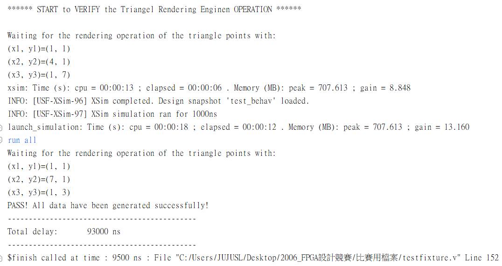
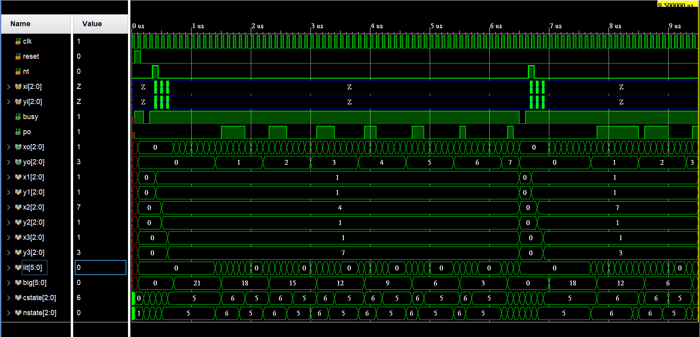
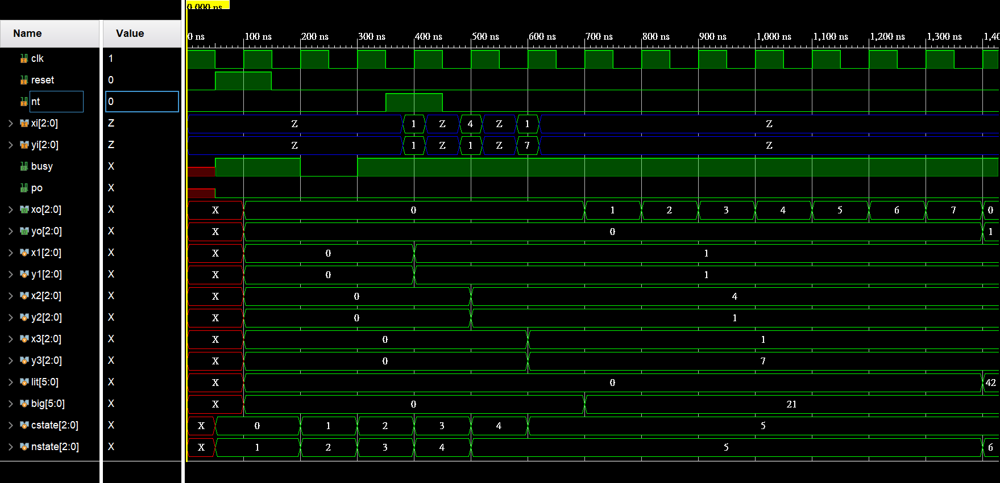
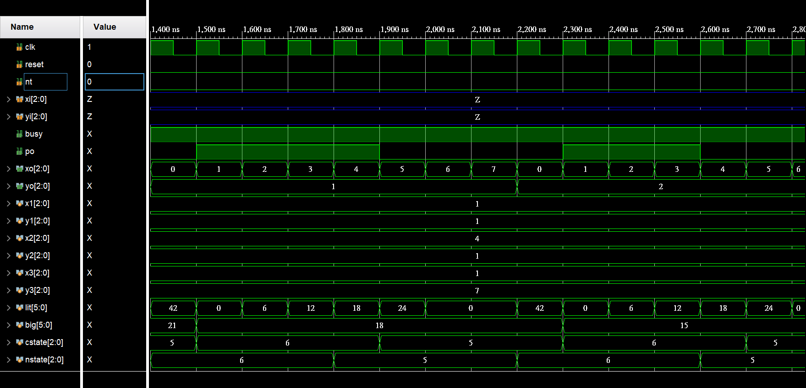
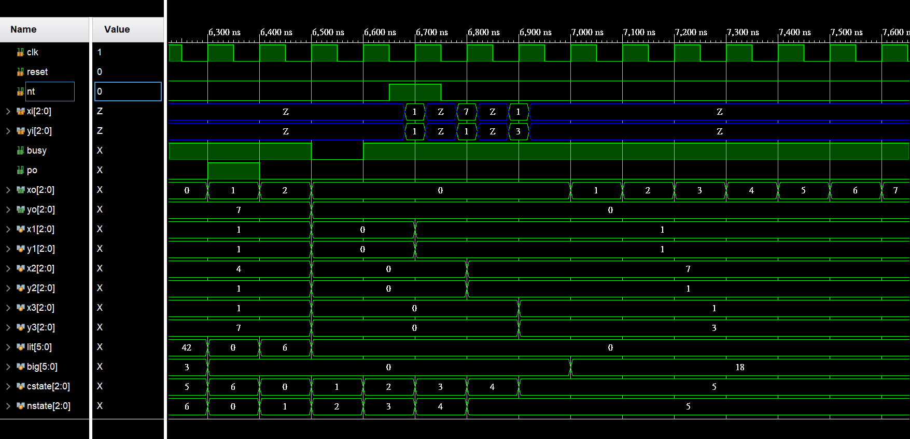

# FPGA-based System Design - Lab00 HW
# 2019_FPGA_Design_Group1
E24056409、E24056263、E14054162

# 問題描述
此直角三角形直角座標轉譯系統
將可於 testbench 所提供的值 角三角形的三個頂點座標(x1,y1),(x2,y2)與(x3,y3)後
轉譯系統將依續完成涵蓋於直角三角形 平面內的所有座標點之輸出

# 設計說明
>　StateDiagram

# 模擬結果圖
> * 測試檔1
> test1

看到testfixture跑出的PASS結果。

# 模擬波形圖
> * 測試檔1
> test1_1 
* 完整波型

* 讀入第一筆三角形座標

* 比較lit與big的值決定是否輸出

* 第一筆資料全部輸出完畢，讀取第二筆三角形資料

