# FPGA-based System Design - Lab00 HW
# 2019_FPGA_Design_Group1
E24056409、E24056263、E14054162

# 問題描述
### Program 1 - 使用板子上的 RGB LED 實現路口交通號誌
作業說明
使用兩顆 RGB LED ，分別代表一個路口的兩個燈號

### 作業需求：

兩個路口的黃燈長(t1)皆為 1 sec ，綠燈長(t2)皆為 5 sec ，兩者皆為紅燈的時間長(t3)為 1 sec (1 sec 不必是實際準確的一秒，可直接使用 Lab 提供的除頻器

一個路口為黃燈或是綠燈時，另一個一定為紅燈

Hint : RGB LED 的控制
一顆 RGB LED 由三個 Bit 控制，分別為 R G B；

對應到 xdc file 上的控制腳位為 RGB LEDs 那欄。

### Result
 * 兩邊皆紅燈
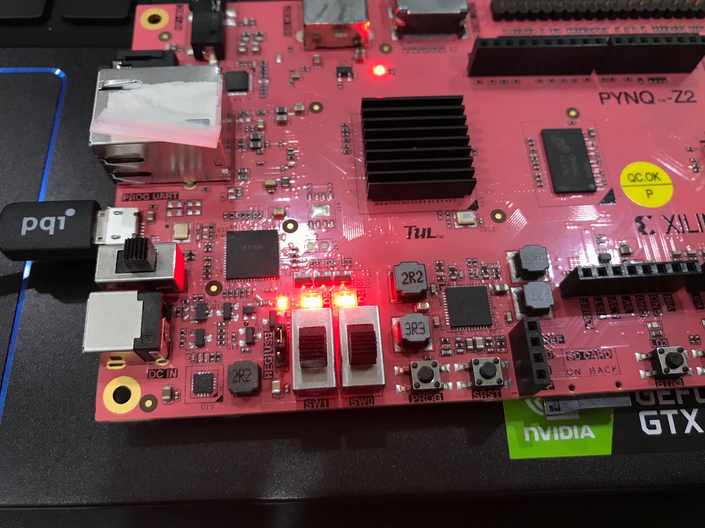
 * 其中一邊路口綠燈
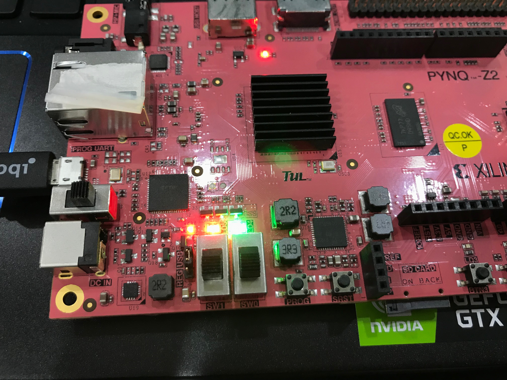
 * 黃燈
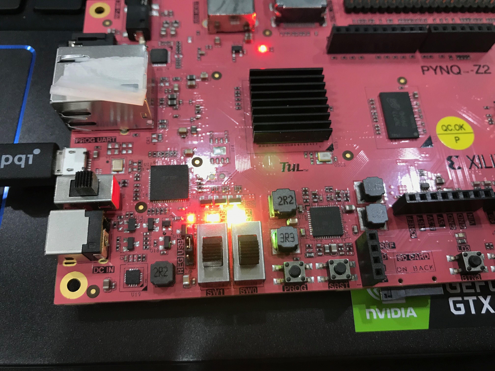
 * 另一邊的路口綠燈
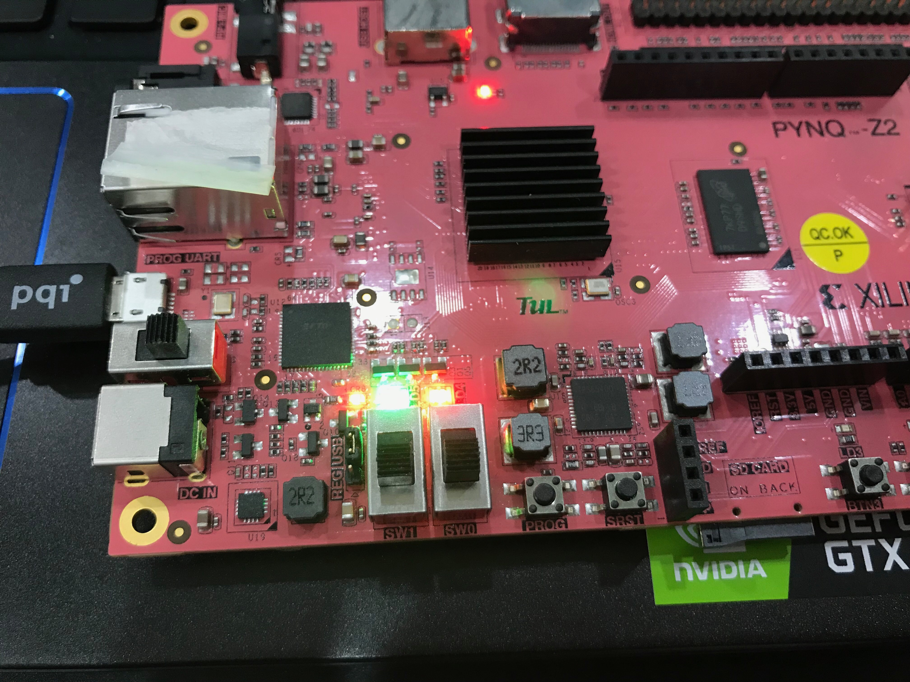
 * 黃燈
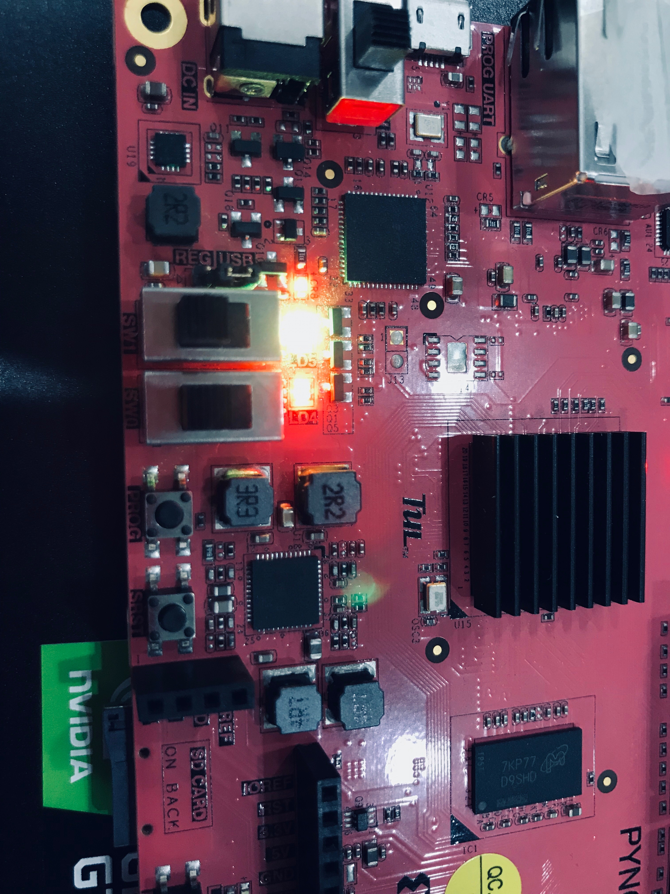
 * 兩邊都紅燈

以上燈號重複循環

### Bonus 

Switch 為 00 時 ，紅綠燈正常運作。

Switch 為 01 時 ，使用 Buttons 調整黃燈長(t1)。

Switch 為 10 時 ，使用 Buttons 調整綠燈長(t2)。

Switch 為 11 時 ，使用 Buttons 調整兩者重疊的紅燈長(t3)。

用 4-bit LED 以二進位顯示秒數。

### Result
 * Switch 為 00 時 ， 燈號時間跟結果同上一個Result

 * Switch 為 01 時 ， 黃燈長本來是1s
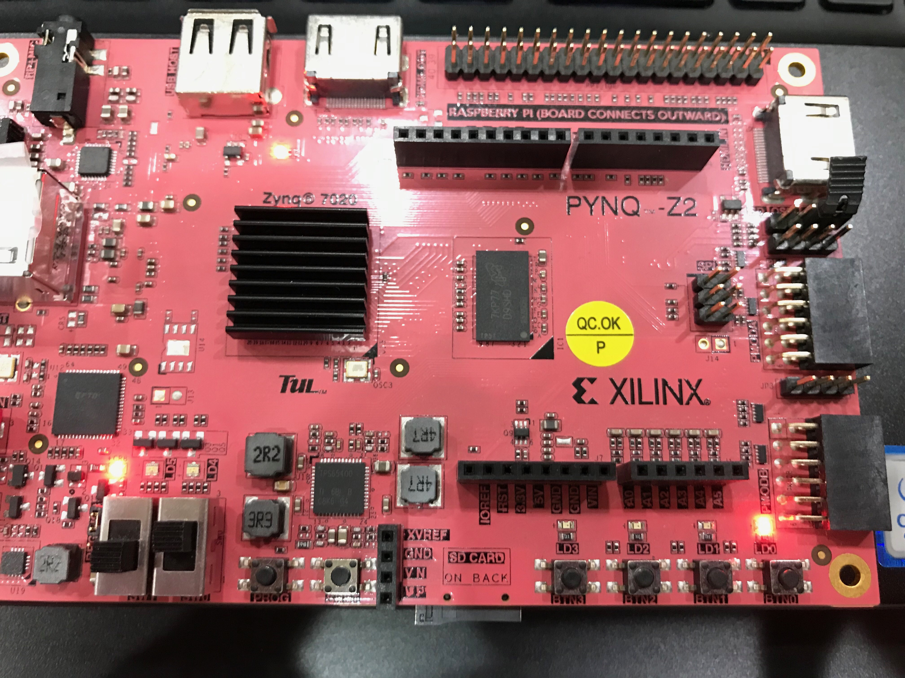
 * 按BTN1可以增加黃燈時間
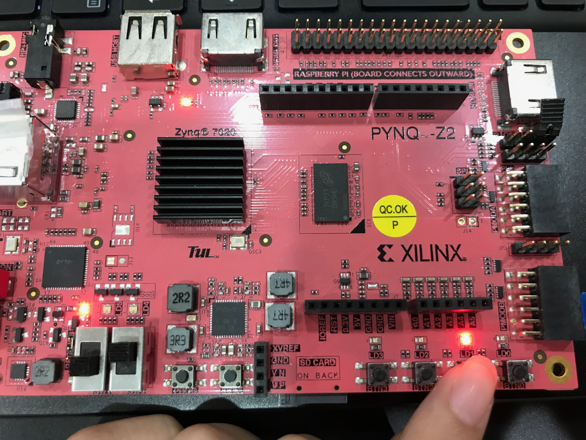
 * Switch 為 10 時 ， 綠燈長本來是5s
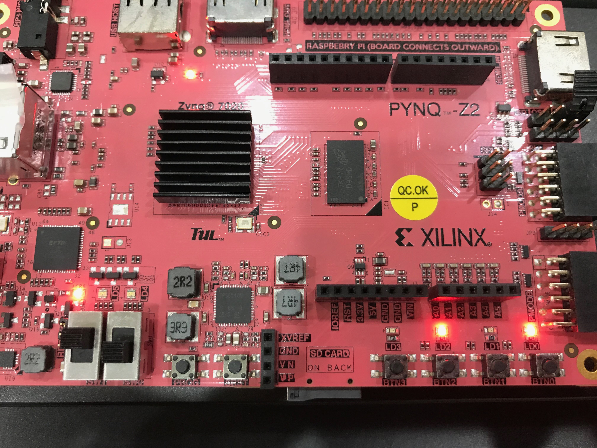
 * 按BTN2可以減少綠燈時間
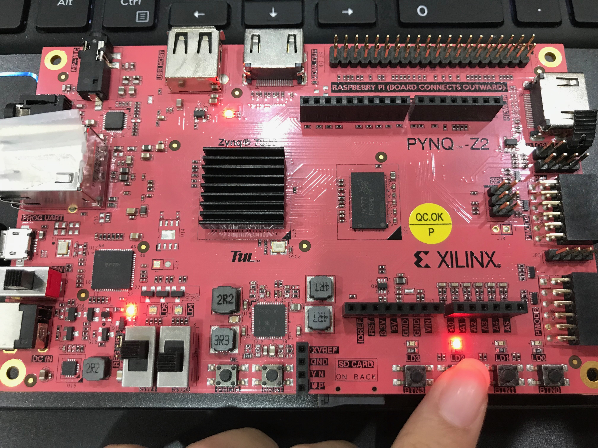
 * Switch 為 11 時 ， 兩邊紅燈長本來是1s
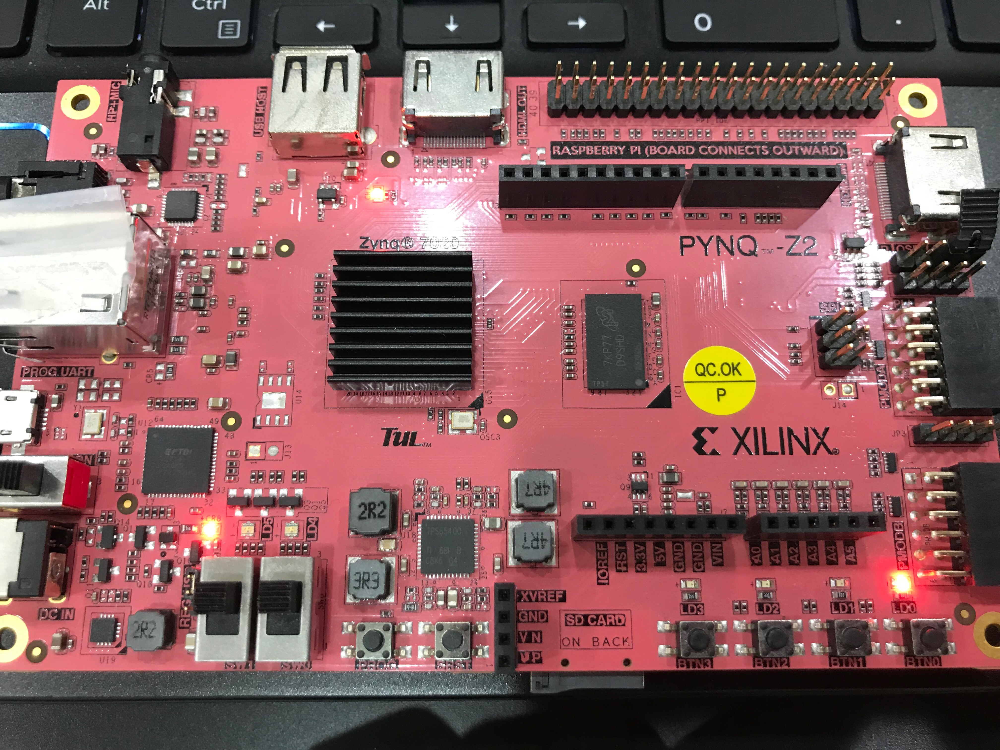
 * 按BTN1可以增加兩邊紅燈時間
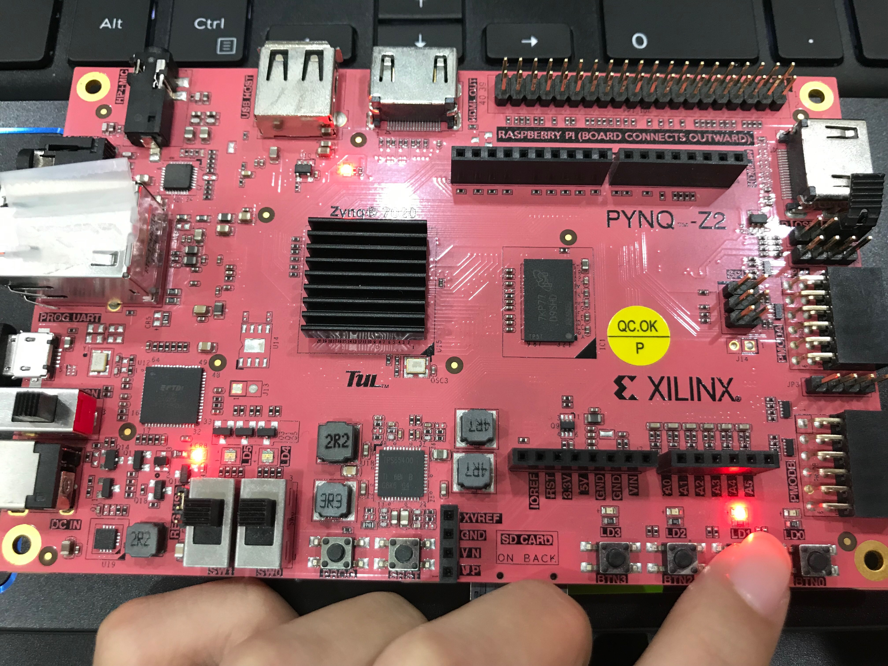
 * 燈號時間最大可以加到15s
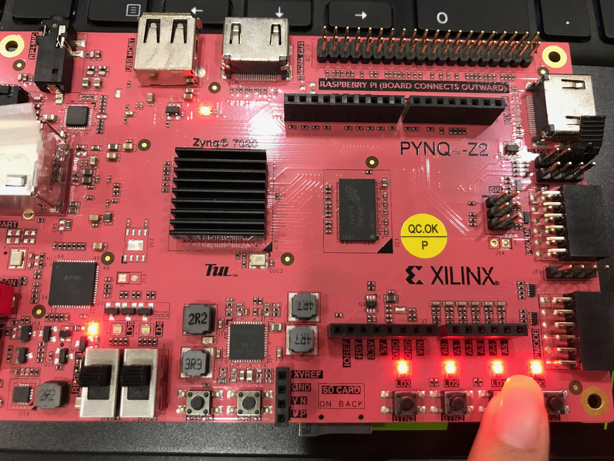

### Bonus 2 
畫出系統設計圖 (非合成後的電路圖)。

# Problems (10%)
1.為什麼要加入 blinky.xdc 這個 Constraint ?
 *blinky.xdc內的程式碼
 
    create_clock -period 8.000 -name sys_clk_pin -waveform {0.000 4.000} -add [get_ports clk]
    create_generated_clock -name clk_div -divide_by 125000000 -source [get_ports clk] [get_pins div_0/clk_div_reg/Q];
    
    
由於工具不了解我們使用的振盪器頻率，因此必須定義適當的時序約束以進行分析。

create_clock 可以定義primary clock 的clock rate、duty cycle

create_generated_clock 則是定義了利用 primary clock所製造出的clock

2.承上題，若沒有加入這個 Constraint，可能會發生什麼事?
 * 當去掉 blinky.xdc 跑 generate bitstream 出現以下的error message
 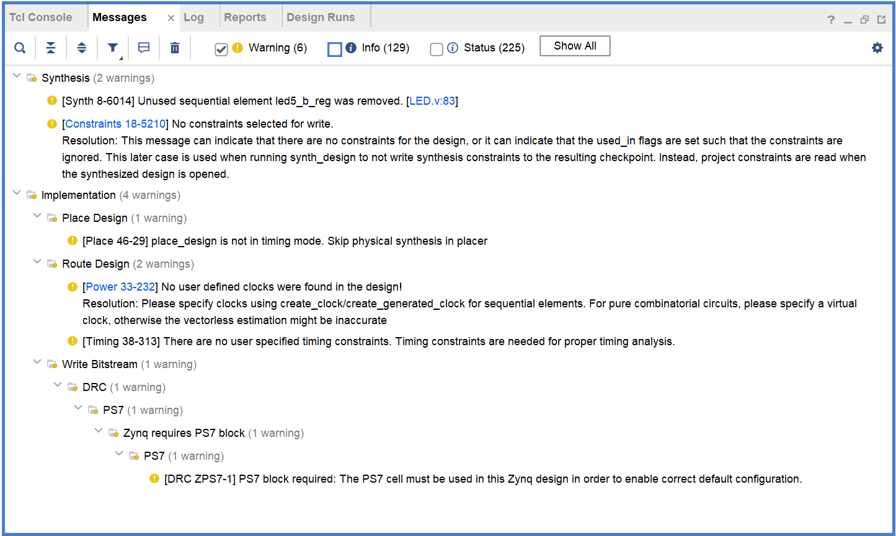
 
 顯示使用者並未定義timing constraints，這樣可能會造成合成後的timing analysis發生錯誤
