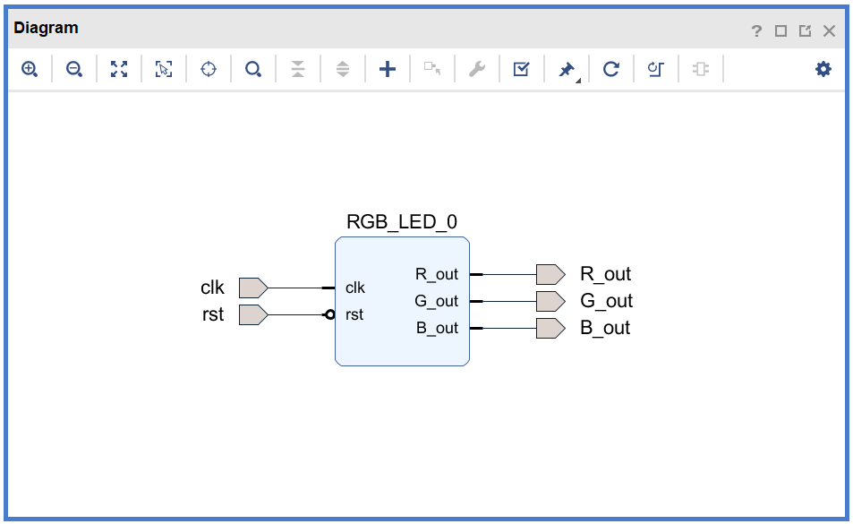

# FPGA-based System Design - Lab02 HW
# 2019_FPGA_Design_Group1
E24056409、E24056263、E14054162

## Program 1 - 使用 PWM 產生彩虹七色 (40%)

### 作業說明

使用一顆 RGB LED ，透過給予不同的 R、G、B time 來產生彩虹七色。

### 作業需求

1. 七種顏色不必淡出淡入，可以分段產生。
> ex : 紅色亮2秒後換橙色，橙色亮2秒後換黃色，依此類推。

2. **必須自己建立IP，使用Block Design完成作業**

3. 上傳作業時須連 IP 資料夾一起上傳。*(參照Lab2-1)*

# 設計說明
>　StateDiagram

# 結果影片

