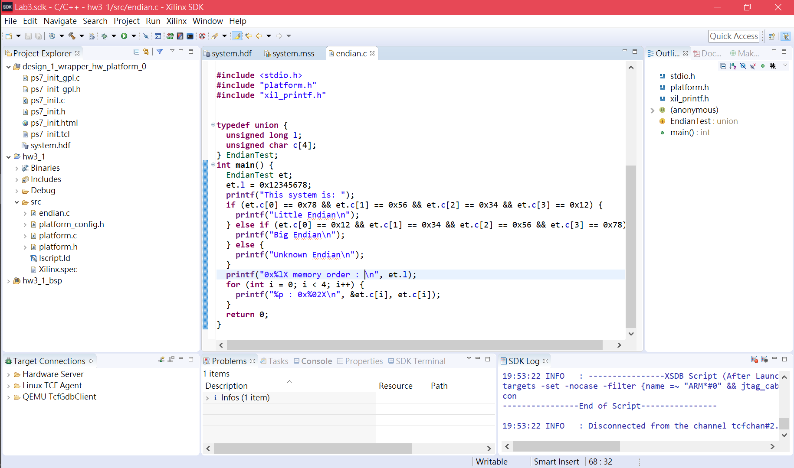
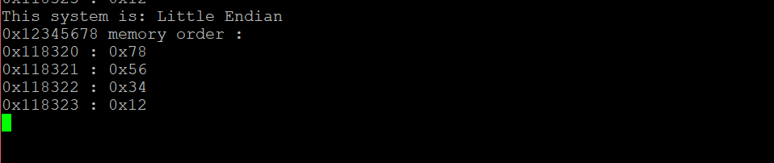
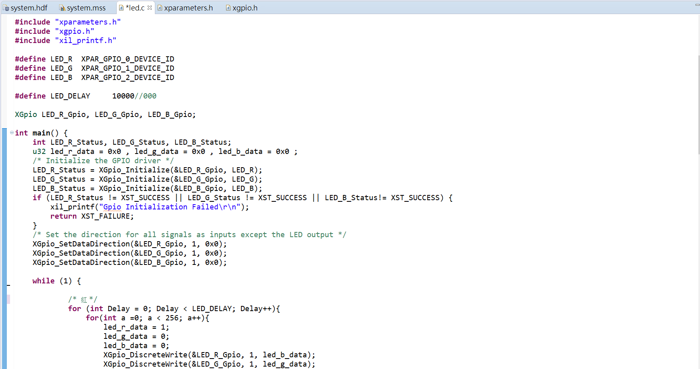
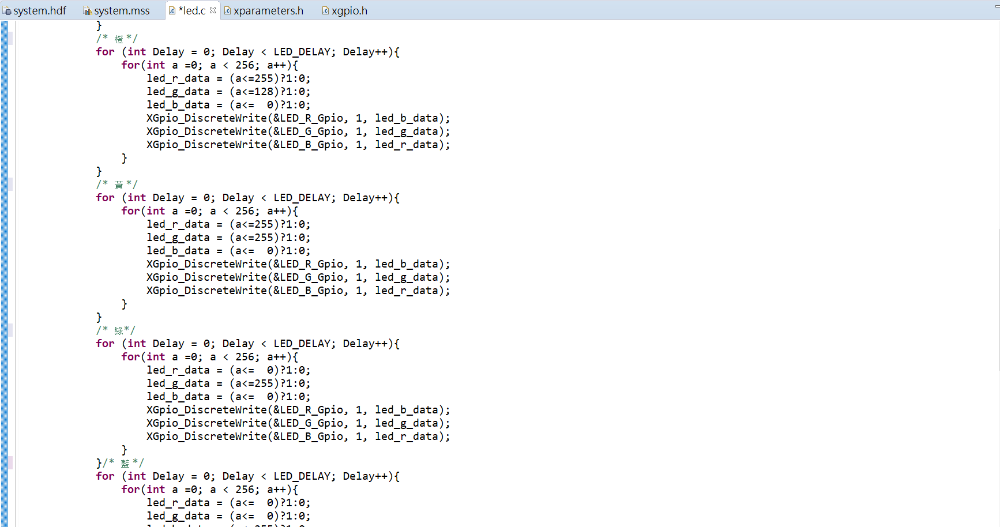
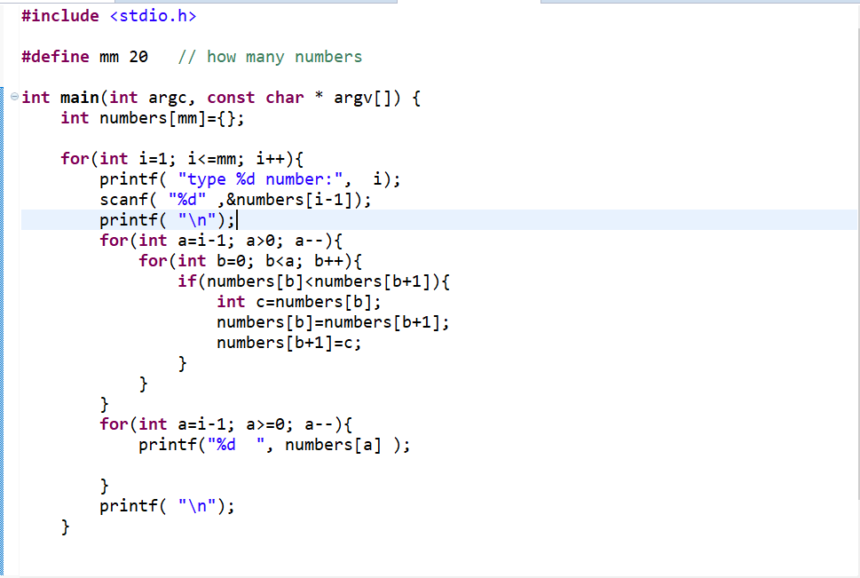
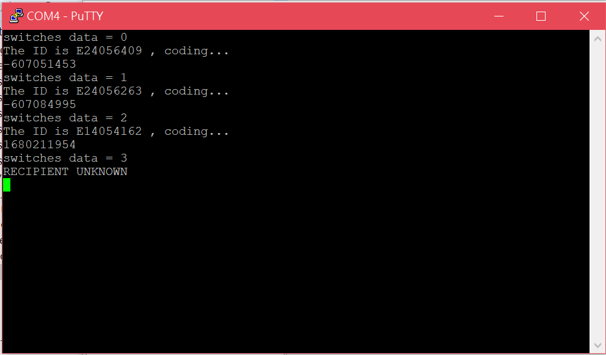
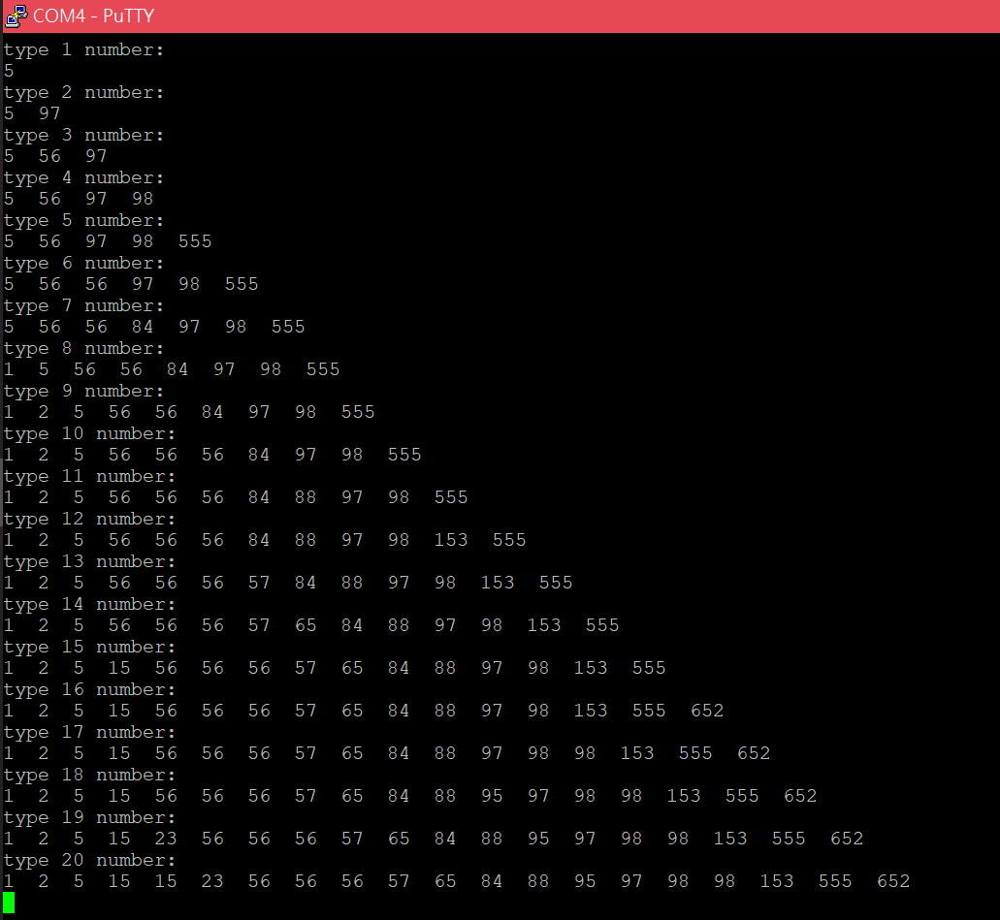

# FPGA-based System Design - Lab03 HW
# 2019_FPGA_Design_Group1
E24056409、E24056263、E14054162

Homework 3
====

# 繳交時間

### Question 1.

請問在不改動任何設定下，ZYNQ CPU 儲存資料的方式是 big-endian 還是 little-endian?

### Result
* 測試code

* 測試code結果截圖

* 說明

   若int，地址＝0x100，值＝0x01234567　（地址範圍為0x100~0x103位元組）

   其內部排列順序依賴於機器的類型：

　　　   big-endian   從首位開始：`0x100: 01, 0x101: 23,..`

　　　   little-endian從末位開始：`0x100: 67, 0x101: 45,..`
   
      ==> 故由結果截圖知 排列從末位開始，因此為 little-endian

### Program 1 - 使用 AXI GPIO - 控制 RGB LED

**作業說明 :** 請依照 Lab 3-2 的方法，建立一個以 Zynq Processor 和 AXI GPIO 組成的系統，並從 PS 控制 RGB LED。

**作業需求 :**

1. 使用 PS 端控制一顆 RGB LED ，使其依序產生彩虹七色。

2. C Code 需加上註解。
### Result
* 測試code

* 測試code結果影片

  

### Program 2 - Hash Function

**作業說明 :** 將組內每個人的學號透過 Hash Function 計算後 Print 在 Terminal 上。

**作業需求 :**

1. 透過 Switch 切換每個人的學號後，直接在 PuTTY 上顯示那組 Switch 對應到哪一組學號，並直接印出 Hash Value。

2. 需在作業說明檔中簡單描述你們選用的 Hash Function。

* 測試code結果截圖

* 說明

   使用 ` 哈希函數BKDR ` 
   
       即 hash(abc) = a * seed^2 + b * seed^1 + c * seed^0       
       seed 通常取 > 127 的質數        
       
      ==> 因此我們取 seed = 131      
      即 hash(abcdefghi) = a * 131^8 + b * 131^7 + c * 131^6 + d * 131^5 + .....

### Program 3 - Sorting

**作業說明 :** 使用鍵盤輸入 20 個非負整數後，將此數列從小排到大。

**作業需求 :**

1. 輸入完一個數字後，以 `Enter(\n)` 區隔下一個數字。

2. 輸入了哪些數字必須更新在 Terminal 上。

3. 需在 README 上簡單註明/講解你們所使用的排序演算法。

* 測試code

* 測試code結果截圖

* 說明
   使用 `bubble sort ` 
   
   將最大的數值移動到陣列最後面，較小的數值則逐漸的往陣列前端移動
   
   就像有許多氣泡慢慢從底部浮出，因此成為氣泡排序法
   
      運作流程如下：

      1. 比較相鄰的兩元素，若前面元素較大 就交換。
      2. 重複進行步驟1直到最後，最後一個元素將會是最大值。
      3. 重複進行步驟1、2，每次比較到上一輪的最後一個元素。
      4. 重複進行以上步驟，直到沒有元素需要比較。
   
