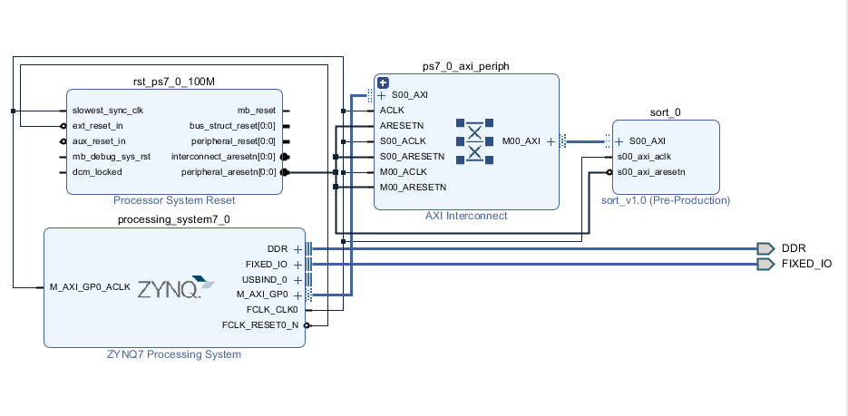

Homework 4
====

### Program 1.

設計一個排序電路，由 processor 輸入一串正整數將其排序後傳回。(數列長度固定)

#### 說明

1. 數字位元數自訂(最少4bit)

2. 數列長度自訂(最少8筆數字)

3. 需在作業說明中註明使用的排序法、定義的數字位元數、數列長度

> 本題所使用的排序是縮減版的bubble sort，也和merge sort有點相似。
> 主要的概念如圖，這樣不斷比較之後就會排序；總共有8筆數字的話只少需要7個STAGE即可排出正確的順序。

> Block design如下圖:

### Program 2.

設計一個計算電路，由 processor 輸入運算子與運算元並回傳運算完的結果。(加, 減, 乘)

#### 說明

1. 資料寬度為8 bit

2. 需考慮有號數(正、負、overflow)

### Program 3.

設計 parity generator，輸入 32-bit 資料回傳其 parity bit (**禁止額外暫存器的使用 ex: counter**)。

### Program 4.

設計 [djb2](http://www.cse.yorku.ca/~oz/hash.html) 這個 hash function 的電路。

### Program 5.

設計 PWM controller。

#### 說明

1. 由 processor 端傳送 R、G、B 三組 PWM 值 (i.e. 色碼值)

2. 透過硬體解碼器驅動 RGB LED 發光

