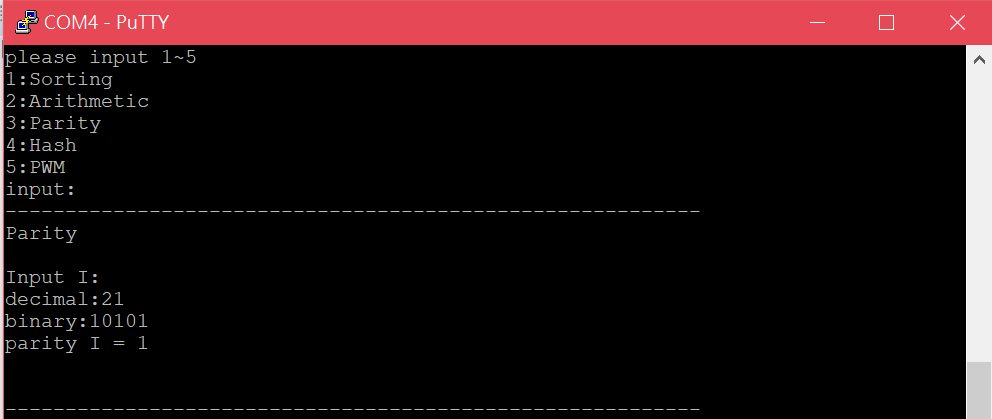

Homework 4
====

### Program 1.

設計一個排序電路，由 processor 輸入一串正整數將其排序後傳回。(數列長度固定)

#### 說明

1. 數字位元數自訂(最少4bit)

2. 數列長度自訂(最少8筆數字)

3. 需在作業說明中註明使用的排序法、定義的數字位元數、數列長度

#### result
* block design

* 結果截圖

* 說明
  1. 本題所使用的排序是縮減版的bubble sort，也和merge sort有點相似。
  2. 數字位元數=4bits
  3. 數列長度=8
  4. 主要的概念如圖，這樣不斷比較之後就會排序；總共有8筆數字的話只少需要7個STAGE即可排出正確的順序。

  
### Program 2.

設計一個計算電路，由 processor 輸入運算子與運算元並回傳運算完的結果。(加, 減, 乘)

#### result
* block design

* 結果截圖

加法

減法

乘法

負數加減乘

overflow

* 說明

  1.資料寬度為8 bit，1bit為sign bit，因此數字大小介於-128 ~ 127之間
  
  2.overflow發生的情況有5種
  
    加法:
    
    (1)正數+正數
    
    (2)負數+負數
    
    減法:
    
    (3)負數-正數
    
    (4)正數-負數
    
    乘法:
    
    (5)乘積太大
    

    以上如果計算結果超出最大可表示位元數就會發生overflow
    
    判斷方式為檢查sign bit是否因為溢位而被改變

  
### Program 3.

設計 parity generator，輸入 32-bit 資料回傳其 parity bit (**禁止額外暫存器的使用 ex: counter**)。
#### result
* block design

  

* 結果截圖

  

* 說明
  1. 可輸入位數<=32 (bit) 的二進制數值
  
  2. 並輸出相對應的parity ，即 
  
          奇數個1 ==> 輸出1  
          偶數個1 ==> 輸出0                             

  3. 作業中為避使用免額外暫存器，使用 `xor作法`：  
  
      因為 xor在 ：
      
          奇數個1 時==> 輸出1      
          偶數個1 時==> 輸出0
          
          ==>將  輸入值  逐位作xor 並直接取其結果作為 parity 輸出
          如下圖：
        

  
### Program 4.

設計 [djb2](http://www.cse.yorku.ca/~oz/hash.html) 這個 hash function 的電路。
#### result
* block design

  

* 結果截圖

  

* 說明
  1. 可輸入任意數值
  
  2. 並輸出相對應的hash值                           

  3. hash公式 
  
      hash = ((hash << 5) + hash) + c;  /* hash * 33 + c */

  
### Program 5.

設計 PWM controller。

#### 說明

1. 由 processor 端傳送 R、G、B 三組 PWM 值 (i.e. 色碼值)

2. 透過硬體解碼器驅動 RGB LED 發光

#### result
* block design

  

* 結果截圖

  
  
> 亮紅燈

  

> 亮綠燈

  

> 亮藍燈

  

> 亮白燈

  

* 說明
  1. 利用前面Lab的PWM來做出顏色變化
  
  2. 使用第四顆LED作為輸出

### Top

將以上5個ip整合在同一個block design中

#### result
* block design

  

* 結果截圖
  
  Sorting
  
  
  Arithmetic
  
  
  Parity
  
  
  Hash
  
  
  PWM
  
