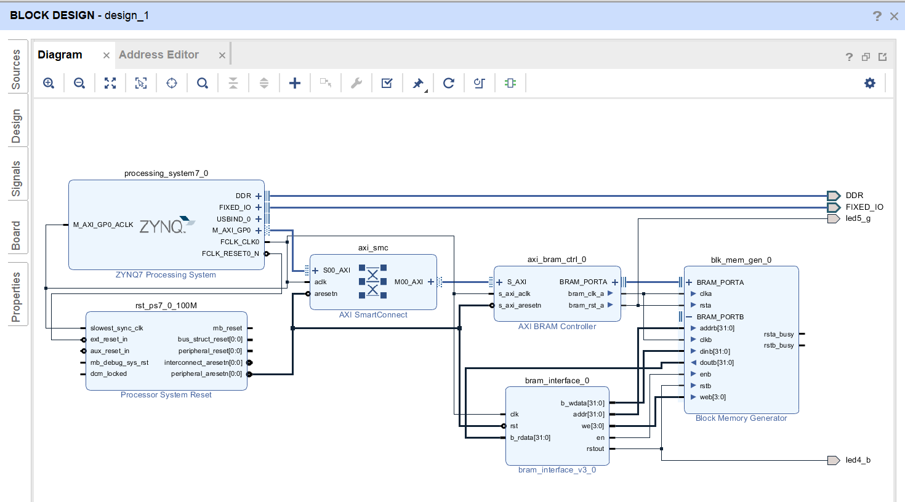

# FPGA-based System Design - Lab05 HW
# 2019_FPGA_Design_Group1
E24056409、E24056263、E14054162

# 問題描述
請務必上傳產生的 bitstream (也就是 `.bit`)，你們寫的 driver，及測試用的 Code，以方便我們評分。

自己做的 IP 一樣要有 OOC。

請勿只交 hdl code。

### Program 1.

設計一個矩陣運算的處理器，可做乘法，加法，減法，轉置，行列式運算。

1. 矩陣運算處理器的指令及資料僅能透過 BRAM 存取。

2. 自行分配 BRAM 中存放指令及資料的位址，並要在 README 告知分配的位址。

3. 矩陣運算處理器運算完後，啟動中斷訊號告知 CPU 存取 BRAM 中的運算結果。 (非必要)

#### RESULT
* Block Design

我們使用vivado的Block Memory Generator(True Dual Port)以及BRAM Controller

AXI BRAM Controller作為BRAM PortA的輸入控制

BRAM PortB則是使用我們自己寫的ip來控制

#### DMA

[AXI DMA](https://www.xilinx.com/support/documentation/ip_documentation/axi_dma/v7_1/pg021_axi_dma.pdf)

[Designing with the AXI DMA core](https://www.xilinx.com/support/answers/57550.html)

[Using AXI DMA in Vivado](https://www.youtube.com/watch?v=Yklu68WopBo)
