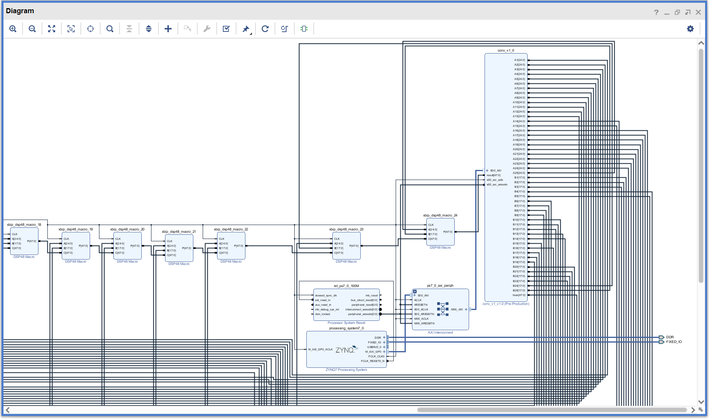
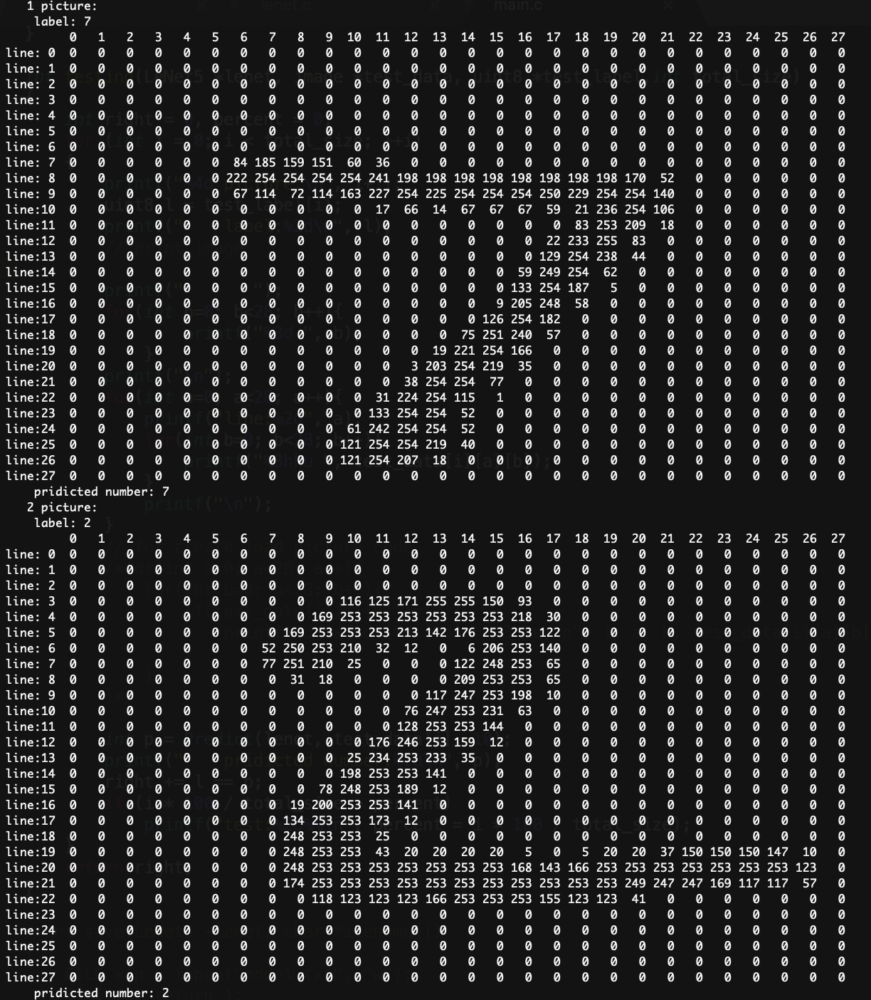
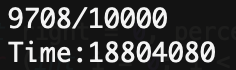
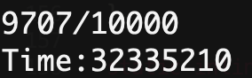
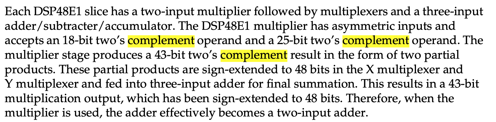

# FPGA-based System Design - Final Project
# 2019_FPGA_Design_Group1
E24056409、E24056263、E14054162

### 目標

利用Xilinx提供的DSP模組進行5\*5的convolution，並且用此硬體運行Lenet-5。

### 硬體架構

使用DSP48E1製作5\*5的convolution。

總共25個DSP48E1模組串接成完整5\*5convolution，每個DSP48E1的乘法是25bits*18bits，相加的bias是48bits，output也是48bits，即為A(25)\*B(18)+C(48)=SOL(48)，再接上AXI controller、ZYNQ processor。

Convolution的feature用18bits的port，weight則是25bits，以最大限度保留model的特性。

* Block Design

做出來的convolution做整數乘法實測可行，結果如下圖：

#### C code

參考[fan-wenjie](https://github.com/fan-wenjie/LeNet-5)寫的C code版本Lenet-5，並做出適合PYNQ-Z2板子的修改，具體如下：

1. Weight讀入由binary read改為直接寫成0.2392839...的形式，讀到小數點下第65位。因為在PYNQ-Z2中要讀檔案需要用特殊的函式庫Xilffs內含的FatFS文件系統，和C原本內建的fopen用法不同，無法用binary的方式讀入，因此需要作轉換。

2. 讀圖片的方法也同樣，因為無法用binary的方法讀，所以改為直接在程式中定義，目前有放兩張圖片做測試。

3. 要將convolution改為硬體來運算需要將原本的for迴圈改掉，整體的架構就會改變，尤其他在convolution的部分是用#define而非一般的function定義，因此我們定義了一個新的函示conv來專門做5\*5 convolution的硬體運算。

4. 將程式碼中訓練的部分去除，因為用FPGA來訓練計算量太大，會跑太久。並且將測試圖片由一萬張改為2張。

5. 由於PYNQ-Z2無法直接將所有weight寫進記憶體運算，因此我們先完成第一層的卷積運算再和由軟體運算（軟體運算的方式也改為和硬體相同，位移16bits和23bits）的結果進行比對，如果相同則代表我們的卷積是成功的，後來實測也是相同的，因此我們可以大膽預測挼PYNQ-Z2有辦法讀入所有權重檔則能夠成功運行Lenet-5的MNIST的手寫數字辨識。

6. 在電腦運行和硬體相同的計算方法，可以成功預測圖片，並且跑一萬張的正確率是一樣的，所以精度沒有下降太多。
  * 原本的正確率：
  
  * 新的運算方法的正確率：
  

#### RESULT

### 問題與討論

1. 大部分的時間都在研究如何從板子將權重檔讀進來，PYNQ-Z2如果可以有更直覺的方式讀取檔案我們會很樂意知道，目前是用Xilffs提供的函式庫，但sdk中Xilffs的資料夾常常會不見而無法引用，時常失靈，應該是sdk的bug。

2. 在程式中，我們使用了malloc將model的weight（lenet，model的struct）要使用的空間清出，並且把值一一讀進lenet中，但是在這裡我們遇到一個困難，PYNQ-Z2的空間不夠讀整個weight（甚至是lenet的第三層weight都讀不進全部），因此我們決定先做出lenet第一層的convolution，來測試我們的convolution是可行的。

3. 在用DSP48E1時，無法確定他的算法是不是可以在[2's complement中通用](https://forums.xilinx.com/t5/AI-Engine-DSP-IP-and-Tools/Two-s-Complement-Multiplier-with-DSP48E1/m-p/320439)，在閱讀Document的時候發現它的確是用2's complement的方法做運算，因此才能適用在我們的5\*5convolution上。

### 參考資料

